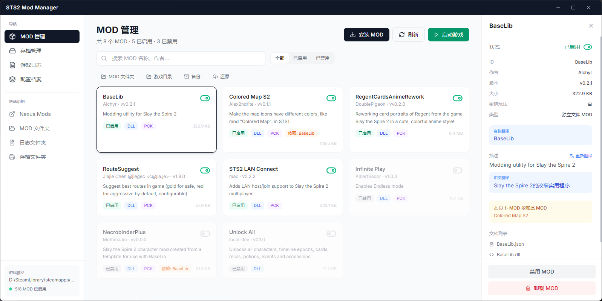
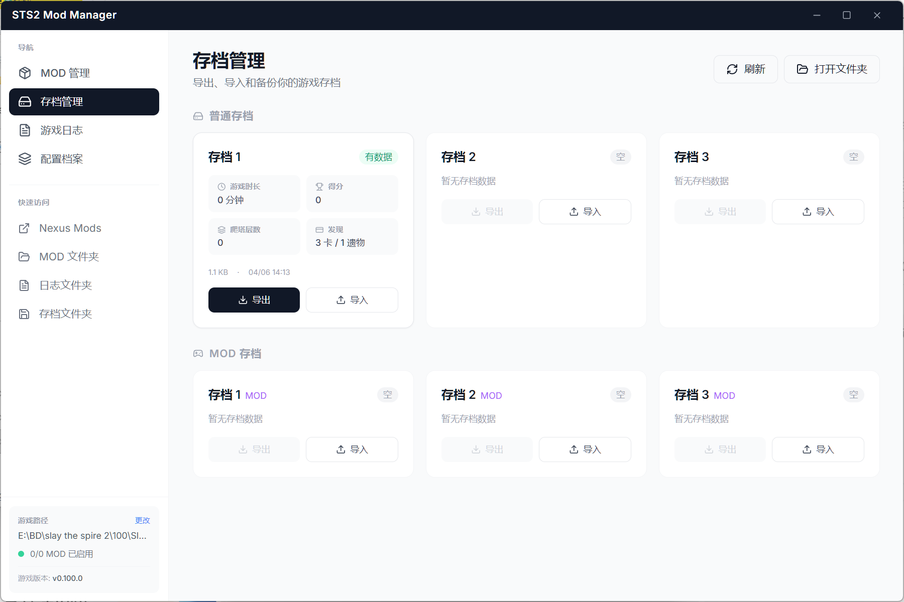

# STS2 Mod Manager

一个给 **Slay the Spire 2** 做的 MOD 管理器，帮你省去手动折腾文件夹的麻烦。

装 MOD、删 MOD、开关 MOD，拖进来就行。





---

## 能干什么

- **MOD 管理** — 一键安装 / 卸载 / 启用 / 禁用，支持拖拽安装 `.zip` `.rar`
- **存档管理** — 普通存档和 MOD 存档分开显示，支持导出备份和导入还原
- **游戏日志** — 实时查看最新日志，出问题能快速定位
- **崩溃分析** — 游戏退出后自动分析日志，告诉你哪个 MOD 可能有问题
- **MOD 翻译** — 看不懂英文描述？点一下自动翻译成中文
- **配置档案** — 保存当前 MOD 启用方案，随时切换不同配置
- **启动游戏** — Steam 正版和非 Steam 版都能直接从管理器启动
- **游戏版本** — 自动读取并显示当前游戏版本号

## 用法

下载 [Releases](https://github.com/ImogeneOctaviap794/sts2-mod-manager/releases) 里的 EXE，双击打开就行。

首次启动会自动检测 Steam 里的游戏路径，找不到的话手动选一下就好，路径会记住。

MOD 安装：
- 点「安装 MOD」选文件
- 或者直接把 `.zip` / `.rar` 拖到窗口里

## 技术栈

| 前端 | 后端 | 打包 |
|------|------|------|
| React + TailwindCSS | Rust (Tauri) | NSIS 安装包 |

也保留了 Electron 版本的代码，如果需要可以用 `npm run build` 构建 Electron 版。

## 本地开发

```bash
# 安装前端依赖
npm install

# Tauri 开发模式
npm run tauri:dev

# Tauri 打包
npm run tauri:build

# Electron 开发模式
npm run dev
```

Tauri 打包需要 Rust 工具链和 VS Build Tools C++ 组件。

## 目录结构

```
src/              React 前端源码
src-tauri/        Tauri 后端 (Rust)
main.js           Electron 主进程
preload.js        Electron 预加载脚本
dist-tauri/       Tauri 前端构建产物
```

## License

MIT
