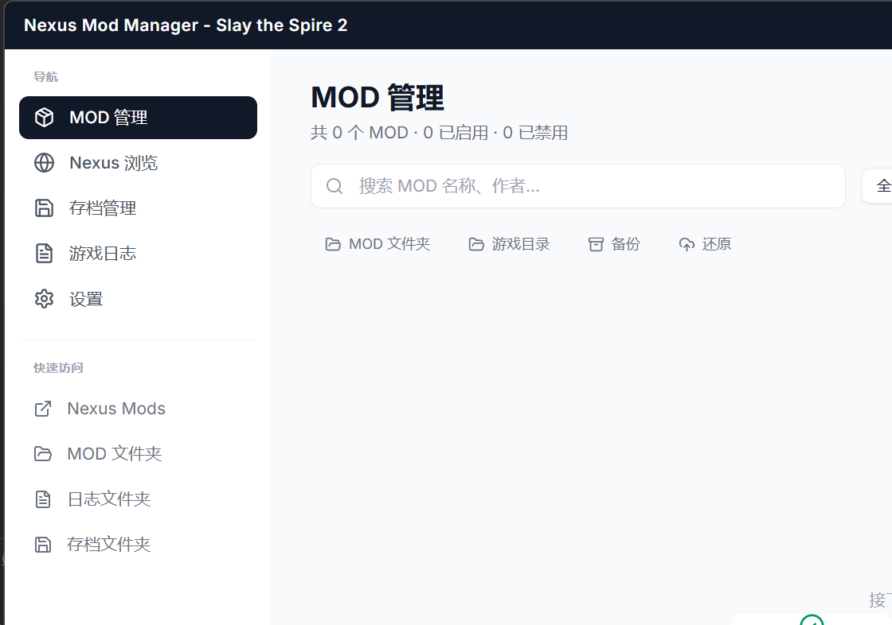

<div align="center">

# STS2 Mod Manager

给《杀戮尖塔 2》玩家的本地 MOD 管理与 Nexus 工作流工具。

基于 [ImogeneOctaviap794/sts2-mod-manager](https://github.com/ImogeneOctaviap794/sts2-mod-manager) Fork 开发，当前维护仓库为 [525300887039/sts2-mod-manager](https://github.com/525300887039/sts2-mod-manager)。

[](https://github.com/525300887039/sts2-mod-manager/releases)
[](https://github.com/525300887039/sts2-mod-manager)
[](LICENSE)


<br>



<br><br>


</div>

## 当前状态

- 这个 fork 延续了原项目的本地 MOD 管理能力，并继续补齐 Nexus 浏览、下载和翻译整合体验。
- 当前仓库代码已经包含 Nexus 分页浏览、Nexus 链接直达 Mod 详情、`file_id` 保留与跳转修复、下载页打开优化，以及压缩包自动安装兼容增强等迭代。
- 截图目前主要展示本地 MOD 管理与存档页面，Nexus 浏览和设置页能力已经集成到当前代码中。

## 功能概览

- 本地 MOD 管理：扫描、安装、卸载、启用、禁用，支持拖拽安装，支持依赖提示、风险标识、排序与双视图切换。
- 压缩包安装：支持 `ZIP`、`RAR`、`7Z` 压缩包自动解包安装；Nexus 下载完成后会优先尝试自动安装支持的归档文件。
- Nexus 工作流：支持热门、最新、最近更新、分页热门、分页最近更新列表，支持查看详情、文件列表、作者信息、评分和下载量。
- Nexus 链接直达：支持直接粘贴 `nexusmods.com/slaythespire2/mods/...` 链接打开对应 Mod，能够识别并保留 `file_id`。
- 翻译系统：支持 MyMemory 和 OpenAI 兼容大模型接口，支持双引擎 fallback、SQLite 缓存、Nexus 文本翻译与富文本清洗。
- 存档与诊断：支持普通存档与 MOD 存档导入导出、自动备份、日志查看，以及崩溃日志分析。
- 设置与配置：支持 Nexus API Key 验证与保存、翻译缓存管理、项目关于页，以及 MOD 配置档案保存和切换。

## 下载与使用

- 最新发布页：<https://github.com/525300887039/sts2-mod-manager/releases>
- 当前主发布链路以 `Tauri v2 + NSIS` 为准，面向 `Windows 10 / Windows 11`。
- 只使用本地 MOD 管理时，不需要额外配置。
- 使用 Nexus 浏览、详情、下载功能前，需要在应用设置页填写并验证自己的 Nexus Mods API Key。
- 某些 Nexus 文件会自动下载安装；如果文件类型不支持自动安装，程序会保留手动安装入口并给出提示。

## 本地开发

```bash
npm install

npm run dev          # Electron 开发模式
npm run build        # Electron 前端打包

npm run tauri:dev    # Tauri 开发模式
npm run tauri:build  # Tauri NSIS 打包
```

### 开发环境

- Node.js 与 npm
- Rust toolchain
- Windows C++ 构建环境，例如 Visual Studio Build Tools

## 技术栈

```text
Frontend  React 18 + Tailwind CSS + Lucide React
Desktop   Tauri v2（主发布链路）+ Electron（兼容/开发链路保留）
Backend   Rust + Tauri Commands
Storage   SQLite（翻译缓存 / Nexus 缓存）+ 本地配置文件
```

## 项目结构

```text
src/            React 前端源码
src-tauri/      Tauri / Rust 后端源码与打包配置
dist/           Electron 渲染进程构建产物
dist-tauri/     Tauri 前端构建产物
main.js         Electron 主进程入口
preload.js      Electron 预加载脚本
docs/           README 截图素材
```

## 仓库关系

- `origin`: <https://github.com/525300887039/sts2-mod-manager>
- `upstream`: <https://github.com/ImogeneOctaviap794/sts2-mod-manager>
