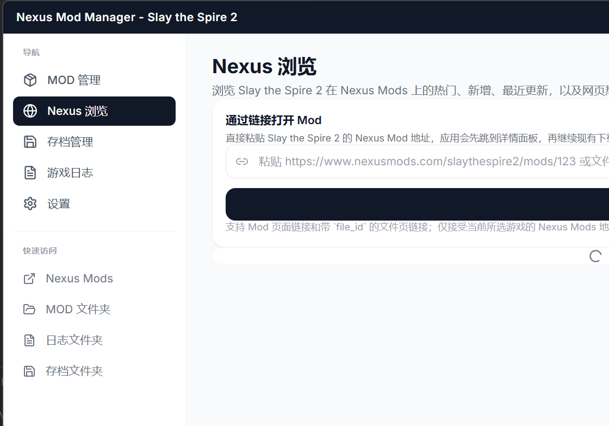
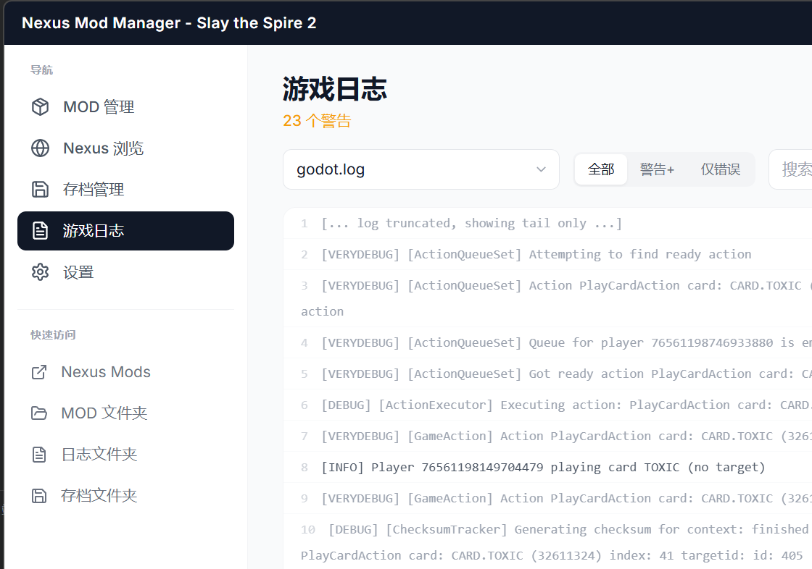
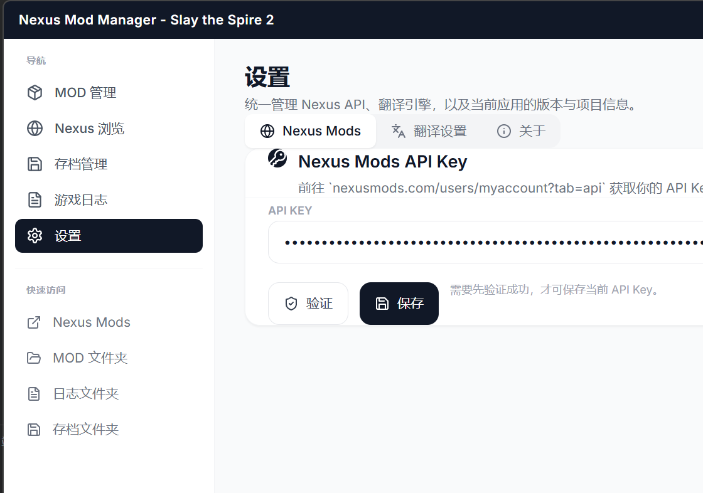
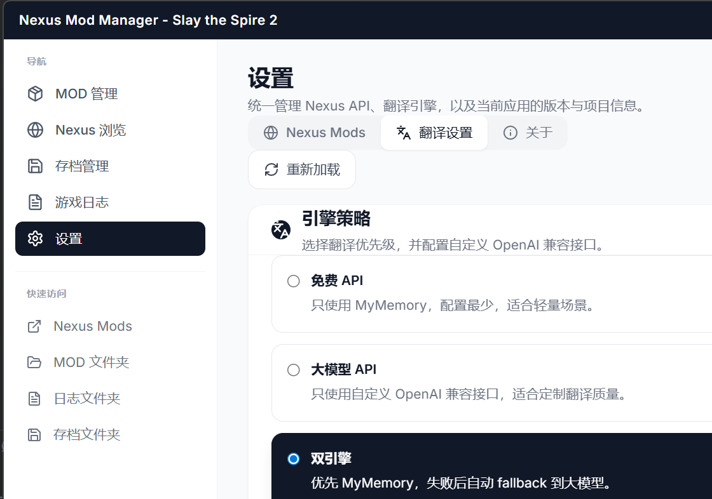
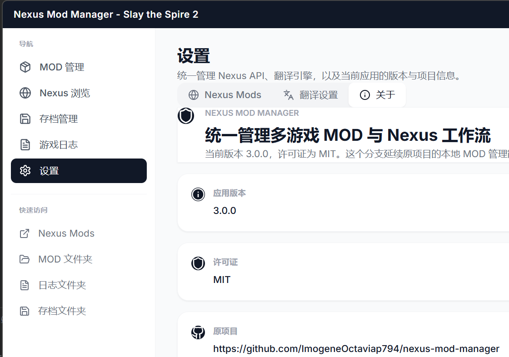

<div align="center">

# Nexus Mod Manager

面向多游戏的 Nexus Mods 桌面管理器，支持浏览、下载、安装、启用、禁用和维护本地 Mod 工作流。

[](https://github.com/525300887039/nexus-mod-manager/releases)
[](https://github.com/525300887039/nexus-mod-manager)
[](LICENSE)


</div>

## Interface Preview

<p align="center">
  
  
</p>

<p align="center">
  
  
</p>

<p align="center">
  
  
</p>

<p align="center">
  
</p>

## Features

- 支持多游戏配置隔离，切换当前游戏时同步切换 Mod、缓存和相关配置。
- 内置常见 Nexus 游戏预设，并支持自定义 `Nexus domain` 和本地安装路径。
- 提供 Nexus 浏览页，可查看热门、新增、最近更新，并直接进入下载流程。
- 支持 ZIP / RAR / 7Z 安装、拖放安装、启用禁用、卸载、备份和恢复。
- 对支持的游戏提供存档管理、日志查看和崩溃分析能力。
- 内置翻译工作流，支持 SQLite 缓存、免费翻译接口和 OpenAI 兼容模型。

## Preset Games

- Slay the Spire 2
- Skyrim Special Edition
- Baldur's Gate 3
- Stardew Valley
- Cyberpunk 2077
- Monster Hunter: World
- Fallout 4
- The Witcher 3
- Elden Ring
- Starfield

## Install

- Release page: <https://github.com/525300887039/nexus-mod-manager/releases>
- 首次启动时选择要管理的游戏；如果未自动识别安装目录，可手动指定路径。
- 使用 Nexus 浏览和下载前，需要在设置页填写并验证自己的 Nexus Mods API Key。

## Build

```bash
npm install
npm run tauri:dev
npm run tauri:build
```

## Refresh Screenshots

```powershell
powershell -ExecutionPolicy Bypass -File .\scripts\capture-readme-screenshots.ps1 -BuildIfMissing
```

这条命令会构建 release 产物并重新生成 `docs/preview-*.png`。

## Development Environment

- Node.js + npm
- Rust toolchain
- Windows C++ build tools

## Tech Stack

```text
Frontend  React 18 + Tailwind CSS + Lucide React
Desktop   Tauri v2
Backend   Rust + Tauri Commands
Storage   SQLite + local JSON config
```

## Project Structure

```text
src/            React frontend source
src-tauri/      Tauri / Rust backend and bundle config
dist-tauri/     Frontend build output used by Tauri
docs/           README screenshots
scripts/        Local maintenance scripts
```

## Repositories

- `origin`: <https://github.com/525300887039/nexus-mod-manager>
- `upstream`: <https://github.com/ImogeneOctaviap794/nexus-mod-manager>
